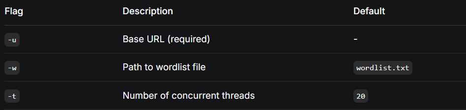
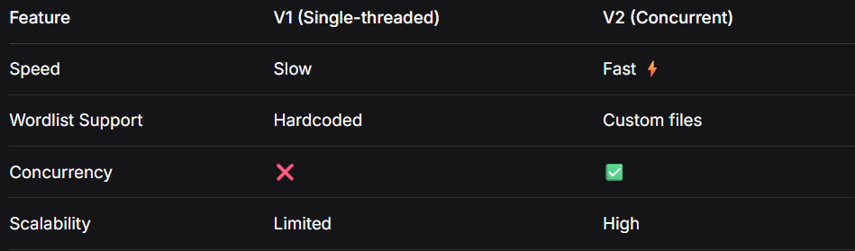

# Web Fuzzer - V2

A fast, concurrent directory enumeration tool for discovering hidden web paths and resources with multi-threading support and custom wordlist loading.

## 📌 Overview

This is a powerful web fuzzer that scans for common and custom directory paths on target web servers. Built with Go's concurrency model, it efficiently handles large wordlists while maintaining high performance.

## 🚀 Features

- **⚡ Concurrent Scanning**: Uses goroutines and channels for parallel processing
- **📂 Custom Wordlist Support**: Load any wordlist from a file
- **🎯 Flexible Targeting**: Specify any base URL via command-line flags
- **🔧 Configurable Threads**: Adjust concurrency level based on your needs
- **📊 Smart Detection**: Identifies all valid paths (status codes 200-399)
- **🧹 Efficient**: Uses HTTP HEAD requests to minimize bandwidth

## 🛠️ Installation

```bash
git clone https://github.com/adelkamell/web-fuzzer.git
cd web-fuzzer
go build
```

### 💻 Usage
Basic Usage
```bash
./web-fuzzer -u http://target.com
```

### Advanced Options
```bash
./web-fuzzer -u http://target.com -w custom_wordlist.txt -t 50
```
### Command Line Flags



Example Wordlist Format
Create a wordlist.txt file with one path per line:

```text
admin
login
dashboard
config
backup
api
test
```

### 📝 How It Works
- Worker Pool: Creates -t number of goroutines (workers)

- Job Queue: Sends words from the wordlist to workers via a channel

- Concurrent Scanning: Each worker tests paths simultaneously

- Result Collection: Valid paths are collected and displayed

- Efficient Completion: Uses WaitGroups to manage all goroutines properly

### 🔮 Future Features
□ Support for different HTTP methods (GET, POST, PUT)
□ Custom headers and cookies
□ Response body analysis
□ Export results to JSON/CSV
□ Recursive directory scanning
□ Extensions support (e.g., .php, .html, .bak)
□ Rate limiting and delay options
□ Proxy support
□ Colorized output
□ Progress bar for long scans

### 🎯 Why Go?
I chose Go for this project because:

🚀 Superior Concurrency: Goroutines and channels make implementing parallel scanning trivial

⚡ Blazing Performance: Compiled language with near C-level speed

📦 Zero Dependencies: The standard library has everything needed for HTTP operations

🔄 Scalable: Easy to add more advanced features like rate limiting and proxies

🎯 Type Safety: Strong typing prevents common runtime errors

🌍 Cross-Platform: Compile once, run anywhere with single binary deployment

📈 Memory Efficient: Handles large wordlists without excessive memory usage

🛡️ Built-in Testing: Excellent testing framework for ensuring reliability

### 🚀 Performance Comparison



### ⚠️ Legal & Ethical Use
Important: This tool should only be used on systems you own or have explicit permission to test. Unauthorized access to computer systems is illegal in most jurisdictions.

### Responsible Usage Guidelines:
✅ Only scan systems you own

✅ Obtain written permission before testing

✅ Respect rate limits and server resources

✅ Use responsibly and ethically

❌ Never use for unauthorized access

❌ Don't overwhelm target servers

### 🤝 Contributing
- Contributions are welcome! Here's how you can help:

- Fork the repository

- Create your feature branch (git checkout -b feature/AmazingFeature)

- Commit your changes (git commit -m 'Add some AmazingFeature')

- Push to the branch (git push origin feature/AmazingFeature)

- Open a Pull Request

### 👤 Author
GitHub: @adelkamell

### Inspired by tools like dirb, gobuster, and ffuf 🫶

### Made with **❤️** for the security community | Version 2.0