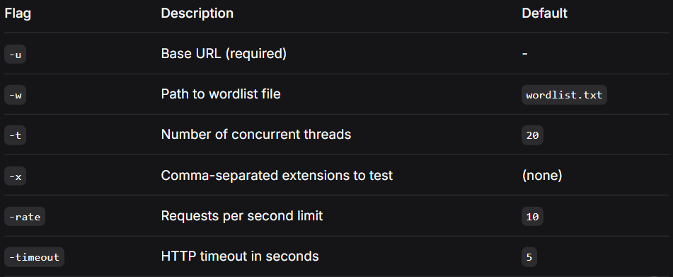
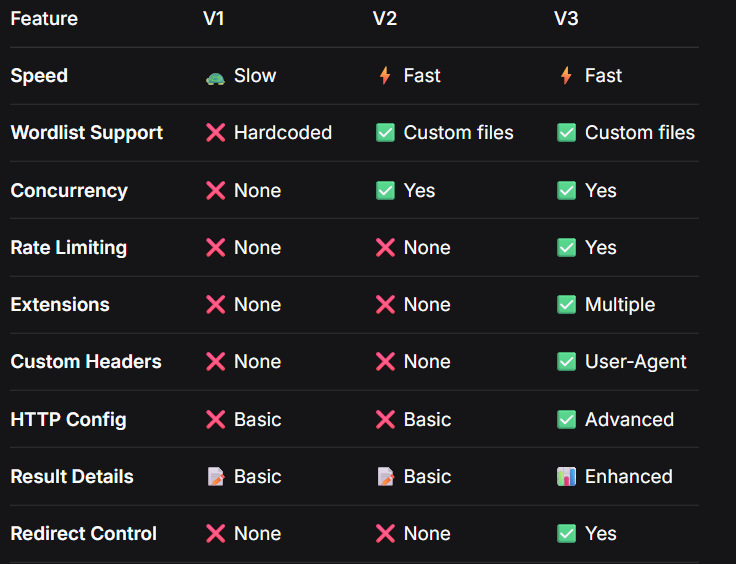

# Web Fuzzer - V3

A powerful, feature-rich web directory and file fuzzer with rate limiting, extension support, custom headers, and advanced HTTP client configuration.

## 📌 Overview

Web Fuzzer V3 is a sophisticated directory enumeration tool designed for security professionals and developers. It combines high-performance concurrent scanning with enterprise-grade features like rate limiting, extension fuzzing, and custom HTTP configurations.

## 🚀 Key Features

### 🔥 Advanced Features
- **🔄 Extension Fuzzing**: Test multiple file extensions (`.php`, `.asp`, `.html`, etc.) in a single scan
- **⏱️ Rate Limiting**: Configure requests per second to avoid overwhelming targets
- **🎭 Custom User-Agent**: Bypass basic WAF rules with customizable user agents
- **📊 Enhanced Results**: Display full URL paths, status codes, and content sizes
- **⏰ Configurable Timeout**: Set HTTP request timeouts for better control
- **🚫 Redirect Control**: Prevent following redirects for accurate status detection

### 🧠 Core Capabilities
- **⚡ Concurrent Scanning**: Efficient goroutine-based parallel processing
- **📂 Custom Wordlist Support**: Load any wordlist from external files
- **🔧 Flexible Configuration**: Extensive command-line options for fine-tuning
- **🎯 Smart Detection**: Identifies valid resources with status codes 200-399

## 🛠️ Installation

```bash
git clone https://github.com/adelkamell/web-fuzzer.git
cd web-fuzzer
go build
```

### 💻 Usage
Basic Example
```bash
./web-fuzzer -u http://target.com -w wordlist.txt
```
### Advanced Examples
Fuzzing with extensions:

```bash
./web-fuzzer -u http://target.com -w wordlist.txt -x php,asp,html,bak
```

### High-performance scanning:

```bash
./web-fuzzer -u http://target.com -w wordlist.txt -t 50 -rate 20
```

### Complete configuration:

```bash
./web-fuzzer -u http://target.com -w big_wordlist.txt -x php,asp,aspx,jsp -t 30 -rate 15 -timeout 3
```
### Command Line Flags



### Wordlist Format
Create a wordlist.txt file with one path per line:

```text
admin
login
dashboard
config
backup
api
test
```
When using extensions, the tool will test each path with all specified extensions.

### 📝 How It Works
Job Queue: Creates a queue of path+extension combinations

Worker Pool: Spawns -t concurrent goroutines

Rate Limiting: Controls request frequency using time.Tick

HTTP Client: Uses configurable client with timeout and redirect control

Result Collection: Captures status codes, content sizes, and full paths

Efficient Completion: Properly manages goroutine lifecycle with WaitGroups

Enhanced V3 Architecture
```text
Wordlist → Extension Combinations → Job Queue → Workers (Rate Limited) → HTTP Requests → Results
```

### 🔮 Future Features
□ Custom HTTP headers (Authorization, Cookies, etc.)
□ Proxy support (HTTP, HTTPS, SOCKS5)
□ Response body analysis (keywords, content matching)
□ Recursive directory scanning
□ Output formats (JSON, CSV, HTML reports)
□ Interactive mode
□ Resume interrupted scans
□ DNS resolution customization
□ HTTP/2 support
□ TLS/SSL configuration options

### 🎯 Why Go?
I chose Go for this project because:

🚀 Superior Concurrency: Goroutines and channels make implementing parallel scanning trivial

⚡ Blazing Performance: Compiled language with near C-level speed

📦 Zero Dependencies: The standard library has everything needed for HTTP operations

🔄 Scalable: Easy to add more advanced features like rate limiting and proxies

🎯 Type Safety: Strong typing prevents common runtime errors

🌍 Cross-Platform: Compile once, run anywhere with single binary deployment

📈 Memory Efficient: Handles large wordlists without excessive memory usage

⏱️ Built-in Rate Limiting: Time.Tick and time.Ticker provide elegant rate control

🛡️ Robust HTTP Client: Excellent HTTP client with fine-grained control

🔧 Simple Error Handling: Clean error handling patterns

### 🚀 Version Evolution



## 🎓 Use Cases
### Security Testing
Discovering hidden administrative panels

Identifying backup files and sensitive resources

Finding old or forgotten web applications

### Development
Validating URL routing configurations

Testing application security

Auditing web application structure

### Research
Understanding web application architecture

Studying common directory patterns

Security research and education

### ⚠️ Legal & Ethical Use
**⚠️ IMPORTANT: This tool should only be used on systems you own or have explicit written permission to test. Unauthorized access to computer systems is illegal in most jurisdictions.**

### Responsible Usage Guidelines
✅ Only scan systems you own

✅ Obtain written permission before testing

✅ Respect rate limits and server resources

✅ Use responsibly and ethically

✅ Configure appropriate delays for public targets

❌ Never use for unauthorized access

❌ Don't overwhelm target servers

❌ Avoid scanning production systems without proper authorization

### 🤝 Contributing
Contributions are welcome! Here's how you can help:

Fork the repository

Create your feature branch (git checkout -b feature/AmazingFeature)

Commit your changes (git commit -m 'Add some AmazingFeature')

Push to the branch (git push origin feature/AmazingFeature)

Open a Pull Request

### Development Setup
```bash
# Clone the repository
git clone https://github.com/adelkamell/web-fuzzer.git

# Install dependencies (if any)
go mod tidy

# Build the project
go build

# Run tests
go test -v
```

### 👤 Author
- Adel Kamell

- GitHub: @adelkamell

### 🙏 Acknowledgments
Thanks to the Go community for excellent tools and libraries

Inspired by tools like dirb, gobuster, ffuf, and dirsearch

Special thanks to security researchers and the open-source community

### **Made with ❤️ for the security community | Version 3.0**

### Version History

- **V1: Basic directory fuzzer**

- **V2: Added concurrency and custom wordlists**

- **V3: Added rate limiting, extensions, and enhanced HTTP client**